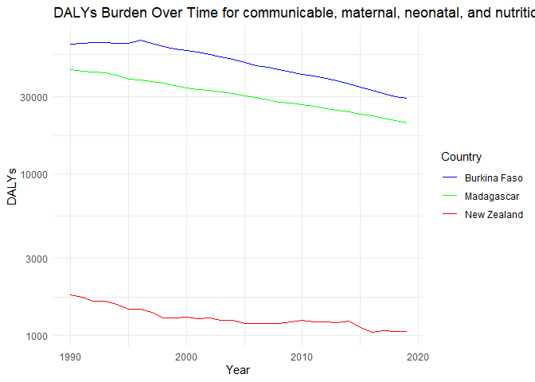
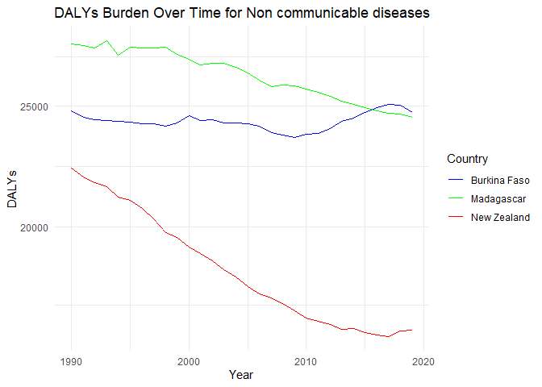

Global Disease Burden Analysis
================
Adrián Calvo-Valderrama

# Introduction

This document compares the Disability-Adjusted Life Year (DALY) diseases
burden for three countries: Burkina Faso, Madagascar, and New Zealand.
We compare the burden due to communicable, maternal, neonatal, and
nutritional diseases (CMNN), non-communicable diseases (NCDs), and
overall disease burden for these countries.

The source data is from the Institute for Health Metrics and Evaluation
(IHME) Global Burden of Disease (GBD) study.

# Communicable, Maternal, Neonatal, and Nutritional Disease Burden (CMNN)

## Table of Estimates for CMNN Burden Over Time

| Year | Burkina Faso | Madagascar | New Zealand |
|-----:|-------------:|-----------:|------------:|
| 1990 |     63755.89 |   44317.32 |    1796.748 |
| 1991 |     64258.61 |   43396.89 |    1720.847 |
| 1992 |     64707.32 |   42540.99 |    1644.171 |
| 1993 |     64619.45 |   42109.18 |    1631.428 |
| 1994 |     64486.32 |   40758.89 |    1570.773 |
| 1995 |     64183.54 |   38794.43 |    1455.488 |
| 1996 |     66891.80 |   37999.64 |    1454.109 |
| 1997 |     64141.29 |   37168.56 |    1398.325 |
| 1998 |     61268.98 |   36290.92 |    1284.592 |
| 1999 |     59629.47 |   35340.64 |    1295.547 |
| 2000 |     57929.90 |   34213.11 |    1303.595 |
| 2001 |     56882.63 |   33342.25 |    1275.729 |
| 2002 |     54955.43 |   32907.67 |    1291.748 |
| 2003 |     53131.82 |   32104.50 |    1250.196 |
| 2004 |     50977.18 |   31352.99 |    1243.502 |
| 2005 |     48976.26 |   30308.68 |    1195.297 |
| 2006 |     46974.09 |   29591.49 |    1190.617 |
| 2007 |     45813.12 |   28802.71 |    1194.924 |
| 2008 |     43993.26 |   27914.46 |    1187.031 |
| 2009 |     42798.42 |   27314.77 |    1215.331 |
| 2010 |     41526.65 |   26829.23 |    1242.680 |
| 2011 |     40393.16 |   26100.70 |    1219.976 |
| 2012 |     39087.38 |   25394.37 |    1214.482 |
| 2013 |     37641.61 |   24818.29 |    1203.585 |
| 2014 |     35988.90 |   24113.59 |    1227.454 |
| 2015 |     34316.02 |   23454.47 |    1130.273 |
| 2016 |     32767.10 |   22785.29 |    1055.163 |
| 2017 |     31316.24 |   22080.50 |    1075.919 |
| 2018 |     30153.88 |   21385.91 |    1066.775 |
| 2019 |     29326.57 |   20622.23 |    1057.054 |

## Plot Showing Trends in CMNN Burden Over Time

<!-- -->

## Summary of CMNN Burden Findings

Disease burden for communicable, maternal, neonatal and nutritional
diseases seems to steadily, although not rapidly decrease in all three
countries. The decrease is less pronounced in New Zealand, where we
might assume access to higher quality care and medicine has been more
constant over the years. Access to such care in the other two countries
seems to have had a greater impact, with a very similar rate of decline
in both.

# Non-Communicable Disease Burden (NCD)

## Table of Estimates for NCD Burden Over Time

| Year | Burkina Faso | Madagascar | New Zealand |
|-----:|-------------:|-----------:|------------:|
| 1990 |     24769.78 |   28035.01 |    22304.67 |
| 1991 |     24505.72 |   27949.93 |    21930.04 |
| 1992 |     24386.23 |   27831.94 |    21711.36 |
| 1993 |     24335.07 |   28186.88 |    21540.30 |
| 1994 |     24297.62 |   27477.88 |    21120.33 |
| 1995 |     24288.18 |   27873.73 |    21000.97 |
| 1996 |     24194.69 |   27838.37 |    20695.77 |
| 1997 |     24180.69 |   27826.82 |    20299.20 |
| 1998 |     24100.31 |   27886.93 |    19785.11 |
| 1999 |     24231.85 |   27482.44 |    19624.02 |
| 2000 |     24578.86 |   27236.46 |    19263.28 |
| 2001 |     24343.96 |   26956.94 |    19034.19 |
| 2002 |     24380.59 |   27061.94 |    18782.97 |
| 2003 |     24219.42 |   27053.54 |    18499.08 |
| 2004 |     24217.21 |   26852.48 |    18251.06 |
| 2005 |     24193.33 |   26575.47 |    17905.91 |
| 2006 |     24105.27 |   26209.38 |    17689.71 |
| 2007 |     23816.58 |   25921.31 |    17549.29 |
| 2008 |     23690.47 |   25992.88 |    17372.00 |
| 2009 |     23609.93 |   25957.53 |    17128.21 |
| 2010 |     23725.00 |   25781.68 |    16914.74 |
| 2011 |     23757.17 |   25625.55 |    16808.92 |
| 2012 |     23998.99 |   25455.11 |    16702.40 |
| 2013 |     24306.48 |   25234.79 |    16570.77 |
| 2014 |     24444.05 |   25068.14 |    16582.48 |
| 2015 |     24715.50 |   24915.37 |    16472.93 |
| 2016 |     24945.55 |   24780.66 |    16378.73 |
| 2017 |     25069.20 |   24682.26 |    16348.92 |
| 2018 |     25025.75 |   24616.48 |    16500.36 |
| 2019 |     24698.78 |   24476.95 |    16536.73 |

## Plot Showing Trends in NCD Burden Over Time

<!-- -->

## Summary of NCD Burden Findings

Although the findings on other diseases burden shows a general downward
trend in all 3 countries, the graph above. for non-communicable
diseases, seems to indicate that some countries are seeing an uptick
since 2010. Burkina Faso and New Zealand both see a slight increase,
although slightly more pronounced in the former, which ends up
overtaking Madagascar in 2015. Madagascar seems to see a more steady
decline over the years, although also less pronounced than for other
forms of disease burden.

# Overall Disease Burden

## Table of Estimates for Overall Disease Burden Over Time

| Year | Burkina Faso | Madagascar | New Zealand |
|-----:|-------------:|-----------:|------------:|
| 1990 |     93405.79 |   76439.83 |    28550.59 |
| 1991 |     93517.96 |   75394.09 |    27975.07 |
| 1992 |     93776.07 |   74311.51 |    27622.21 |
| 1993 |     93599.20 |   74230.45 |    27363.84 |
| 1994 |     93395.43 |   72119.38 |    26809.51 |
| 1995 |     93039.41 |   70114.77 |    26606.36 |
| 1996 |     95593.84 |   69246.38 |    26270.67 |
| 1997 |     92794.79 |   68456.86 |    25777.02 |
| 1998 |     89818.60 |   67579.16 |    25041.58 |
| 1999 |     88248.87 |   66176.67 |    24814.58 |
| 2000 |     86915.19 |   64853.61 |    24400.99 |
| 2001 |     85511.61 |   63579.65 |    24095.31 |
| 2002 |     83607.57 |   63268.27 |    23823.47 |
| 2003 |     81593.03 |   62426.76 |    23433.56 |
| 2004 |     79461.50 |   61494.28 |    23125.15 |
| 2005 |     77369.97 |   60040.78 |    22665.18 |
| 2006 |     75287.16 |   58852.72 |    22378.77 |
| 2007 |     73748.99 |   57758.50 |    22221.56 |
| 2008 |     71787.69 |   56950.79 |    22016.61 |
| 2009 |     70466.07 |   56322.57 |    21734.08 |
| 2010 |     69369.48 |   55588.41 |    21459.36 |
| 2011 |     68272.76 |   54651.81 |    21480.51 |
| 2012 |     67348.62 |   53778.51 |    21122.25 |
| 2013 |     66301.89 |   52932.41 |    20890.82 |
| 2014 |     64867.91 |   52090.39 |    20907.28 |
| 2015 |     63545.21 |   51197.35 |    20694.73 |
| 2016 |     62365.88 |   50336.57 |    20526.85 |
| 2017 |     61058.19 |   49532.03 |    20532.00 |
| 2018 |     59831.22 |   48737.65 |    20668.98 |
| 2019 |     58768.86 |   47777.99 |    20681.60 |

## Plot Showing Trends in Overall Disease Burden Over Time

<!-- -->

## Summary of Overall Disease Burden Findings

The graph above shows decreasing Disability-Adjusted Life Years burden
in all three countries between 1990 and 2003.The decrease is slightly
sharper in the case of Burkina Faso, although we can observe a short
spike in the mid 1990’s. New Zealand’s decrease is steadier and less
pronounced. This visualization suggests progress in access to health
care and general advances in medicine had a more significant impact in
less industrialized countries than in a country like New Zealand, where
such access and quality of health services have presumably always been
greater.
